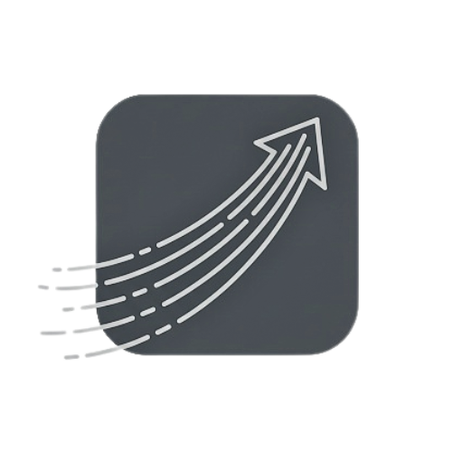

# Aegis Forensics

<div align="center">
  
  <h3>AI-Powered Digital Forensics Platform</h3>
  <p><em>Advanced Cybersecurity Investigation & Analysis</em></p>
  
  [](https://python.org)
  [](https://fastapi.tiangolo.com)
  [](https://nextjs.org)
  [](https://typescriptlang.org)
  [](LICENSE)
  [](https://github.com/sarthakpriyadarshi/AegisForensics)
</div>

## 🔍 Overview

Aegis Forensics is a cutting-edge digital forensics platform that leverages AI-powered agents to provide comprehensive cybersecurity investigation capabilities. Built with modern web technologies, it offers automated forensic analysis, real-time system monitoring, and intelligent threat detection for security professionals and investigators.

## ✨ Key Features

### 🤖 AI-Powered Analysis
- **Specialized AI Agents**: Dedicated agents for memory, disk, network, binary, and timeline analysis
- **Automated Intelligence**: Pattern recognition and anomaly detection
- **Live Response**: Real-time incident response automation
- **Behavioral Analysis**: User profiling and activity pattern detection

### 🔐 Security & Authentication
- **JWT Authentication**: Secure bearer token-based authentication
- **Admin Management**: Single admin user system with secure setup
- **Password Policies**: 90-day password rotation and security enforcement
- **Secure API**: Protected endpoints with comprehensive authorization

### 📊 Comprehensive Analysis
- **Memory Forensics**: RAM dumps, process analysis, rootkit detection
- **Disk Analysis**: File system examination, deleted file recovery
- **Network Investigation**: PCAP analysis, traffic pattern detection
- **Binary Analysis**: Malware reverse engineering and behavior assessment
- **Timeline Reconstruction**: Event correlation and chronological analysis

### 🌐 Modern Web Interface
- **Responsive Dashboard**: Intuitive web-based investigation interface
- **Real-time Monitoring**: Live system metrics and health status
- **Case Management**: Organized evidence and investigation tracking
- **Script Generation**: Automated forensic script creation for remote deployment

## 🏗️ Architecture

```
┌─────────────────────────────────────────────────────────────┐
│                    Aegis Forensics Platform                 │
├─────────────────────────────────────────────────────────────┤
│  Frontend (Next.js + TypeScript)                           │
│  ├── Dashboard & Analytics                                 │
│  ├── Case Management                                       │
│  ├── Real-time Monitoring                                  │
│  └── Evidence Analysis Interface                           │
├─────────────────────────────────────────────────────────────┤
│  Backend API (FastAPI + Python)                            │
│  ├── Authentication & Authorization                        │
│  ├── Case & Evidence Management                            │
│  ├── System Monitoring & Health                            │
│  └── Script Generation & Analysis                          │
├─────────────────────────────────────────────────────────────┤
│  AI Forensic Agents                                        │
│  ├── 🧠 Memory Analyzer                                     │
│  ├── 💾 Disk Analyzer                                       │
│  ├── 🌐 Network Analyzer                                    │
│  ├── ⚙️  Binary Analyzer                                    │
│  ├── ⏱️  Timeline Agent                                     │
│  ├── 👤 User Profiler                                       │
│  ├── 🏃 Live Response Agent                                 │
│  └── 🔬 Sandbox Agent                                       │
├─────────────────────────────────────────────────────────────┤
│  Data Storage                                               │
│  ├── SQLite Database                                       │
│  ├── File Storage                                          │
│  └── Evidence Repository                                   │
└─────────────────────────────────────────────────────────────┘
```

## 🚀 Quick Start

### Prerequisites
- **Python 3.8+** for backend
- **Node.js 18+** for frontend
- **Git** for version control

### Installation

1. **Clone the repository**
   ```bash
   git clone https://github.com/sarthakpriyadarshi/AegisForensics.git
   cd AegisForensics
   ```

2. **Setup Backend**
   ```bash
   cd backend
   python -m venv .venv
   source .venv/bin/activate  # On Windows: .venv\Scripts\activate
   pip install -r requirements.txt
   python main.py
   ```

3. **Setup Frontend**
   ```bash
   cd ../  # Return to root directory
   npm install
   npm run dev
   ```

4. **Access the Application**
   - Frontend: http://localhost:3000
   - Backend API: http://localhost:8000
   - API Documentation: http://localhost:8000/docs

### First-Time Setup

1. **Create Admin User**: Navigate to `/auth/setup` to create the first admin account
2. **Login**: Use your admin credentials to access the dashboard
3. **Start Investigation**: Upload evidence files or create new cases

## 📖 API Documentation

The complete API documentation is available at `/docs` when the backend is running. Key endpoints include:

### Authentication
- `POST /auth/setup-admin` - Create first admin user
- `POST /auth/login` - User authentication
- `GET /auth/me` - Get current user info

### Case Management
- `GET /api/cases` - List all cases
- `POST /api/cases` - Create new case
- `GET /api/cases/{id}` - Get case details
- `POST /api/cases/{id}/analyze` - Analyze evidence for case

### Analysis & Evidence
- `POST /analyze/uploadfile/` - Upload file for analysis
- `GET /api/evidence/{id}` - Get evidence details
- `GET /api/evidence/{id}/status` - Check analysis status

### System Monitoring
- `GET /health` - Health check
- `GET /system/info` - System information
- `GET /system/metrics` - Real-time metrics

### Script Generation
- `POST /api/scripts/generate` - Generate forensic scripts
- `GET /api/scripts/platforms` - Supported platforms
- `POST /api/scripts/download` - Download scripts

## 🔧 Configuration

### Environment Variables
Create a `.env` file in the backend directory:

```bash
# Database
DATABASE_URL=sqlite:///./aegis_forensics.db

# JWT Configuration
SECRET_KEY=your-secret-key-here
ALGORITHM=HS256
ACCESS_TOKEN_EXPIRE_MINUTES=30

# Server Configuration
HOST=0.0.0.0
PORT=8000
DEBUG=false
```

### Frontend Configuration
Update `next.config.ts` for custom settings:

```typescript
const nextConfig = {
  env: {
    BACKEND_URL: process.env.BACKEND_URL || 'http://localhost:8000',
  },
}
```

## 🛠️ Development

### Backend Development
```bash
cd backend
source .venv/bin/activate
uvicorn main:app --reload --host 0.0.0.0 --port 8000
```

### Frontend Development
```bash
npm run dev
# or
yarn dev
```

### Running Tests
```bash
# Backend tests
cd backend
python -m pytest

# Frontend tests
npm test
```

## 📊 Supported File Types

| Category | File Types | Analysis Capabilities |
|----------|------------|----------------------|
| **Memory** | `.mem`, `.dmp`, `.raw` | Process analysis, rootkit detection, malware identification |
| **Disk** | `.img`, `.dd`, `.e01` | File system analysis, deleted file recovery, timeline creation |
| **Network** | `.pcap`, `.pcapng`, `.cap` | Traffic analysis, protocol detection, IoC extraction |
| **Binary** | `.exe`, `.dll`, `.bin` | Malware analysis, reverse engineering, behavioral assessment |
| **Archives** | `.zip`, `.rar`, `.7z` | Content extraction, recursive analysis |
| **Documents** | `.pdf`, `.doc`, `.txt` | Metadata extraction, content analysis |

## 🔌 Integrations

- **YARA Rules**: Malware detection and classification
- **Volatility**: Memory analysis framework
- **Autopsy**: Digital forensics platform
- **Wireshark**: Network protocol analyzer
- **Custom APIs**: RESTful integration with security tools

## 🤝 Contributing

We welcome contributions! Please see our [Contributing Guidelines](CONTRIBUTING.md) for details.

1. Fork the repository
2. Create a feature branch (`git checkout -b feature/amazing-feature`)
3. Commit your changes (`git commit -m 'Add amazing feature'`)
4. Push to the branch (`git push origin feature/amazing-feature`)
5. Open a Pull Request

## 📝 License

This project is licensed under the MIT License - see the [LICENSE](LICENSE) file for details.

## 🆘 Support

- **Documentation**: Complete guides in `/docs`
- **Issues**: GitHub Issues for bug reports
- **Discussions**: GitHub Discussions for questions
- **Email**: support@aegisforensics.com

## 🗺️ Roadmap

- [ ] **Advanced AI Models**: Integration with latest forensic AI models
- [ ] **Cloud Support**: AWS/Azure deployment options
- [ ] **Mobile App**: iOS/Android companion application
- [ ] **Advanced Reporting**: Automated forensic report generation
- [ ] **Multi-tenancy**: Support for multiple organizations
- [ ] **Real-time Collaboration**: Team investigation features

---

<div align="center">
  <p>Made with ❤️ by the Aegis Forensics Team</p>
  <p><strong>Empowering Cybersecurity Professionals Worldwide</strong></p>
</div>
